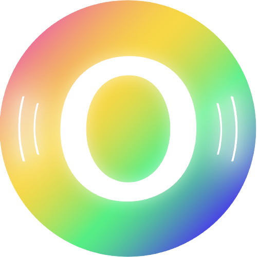

  
  

<h1 align="center">Applied AI Centre of Excellence</h1>

<strong>Government Polytechnic, Bhubaneswar × Ooumph</strong>

<em>Build real. Deploy smart. Engineer the future.</em>

---

An applied-AI workforce programme for diploma engineers across every branch — students build, deploy, and defend real systems. This organisation hosts the working portfolios of each cohort. Every repository is a defendable artefact, not a notebook dump.

### How We Work
* 🔁 **Loop:** Concept → Demo → Guided Lab → Practice. A commit every session.
* 📝 **Evidence:** Every project carries `README.md`, `AI_USAGE.md`, and a prompt log.
* ⚖️ **Standard:** AI use is disclosed and logged; outputs are verified; authors defend their work live.
* 🛠️ **Stack:** Google Colab · GitHub · Hugging Face · scikit-learn / Keras · FastAPI / Edge Impulse.

### Cohorts
* `f26-*` — Foundation 2026 (NSQF 3.5 · multi-branch)

### Governance & Ethics
Operated under the GP Bhubaneswar × MyOoumph Networks CoE framework.
No facial-recognition deployments · DPDP-compliant data handling.

---

  📍 Govt. Polytechnic, Bhubaneswar · Odisha &nbsp;&nbsp;|&nbsp;&nbsp; ✉️ <a href="mailto:info@ooumph.com">info@ooumph.com</a>

